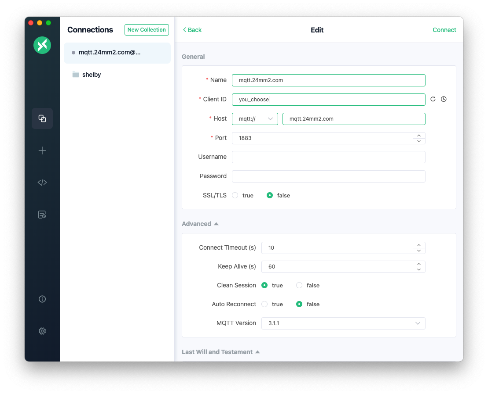
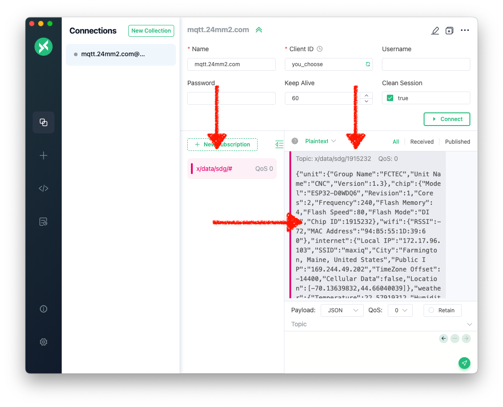

# MQTT

Data from the Starter Kit is posted to an MQTT server. The data is the loaded into a ELK Server, where the data can be visualised in Kibana.
The ELK server is dated, but it serves it's purpose. There is no immidiate plan to upgrade the server.
However you can read the data from the MQTT server and load them into your visualisation of choice.

## MQTT access
- Server: mqtt.24mm2.com
- Port: 1883
- Topic (generic): /x/data/sdg/#
- Topic (specific): /x/data/sdg/nn, where nn is the chipid
- Format: JSON

### Login and security
No username nor password, no SSL/TLS

## Tryout
You can try with [MQTTX from the MacOS App store](https://apps.apple.com/za/app/mqttx/id1514074565)

Here is the configuration of the server:

And here is the subscription:
Notice the topic includes the chipid, which you can find first by using a wildcard (#).

